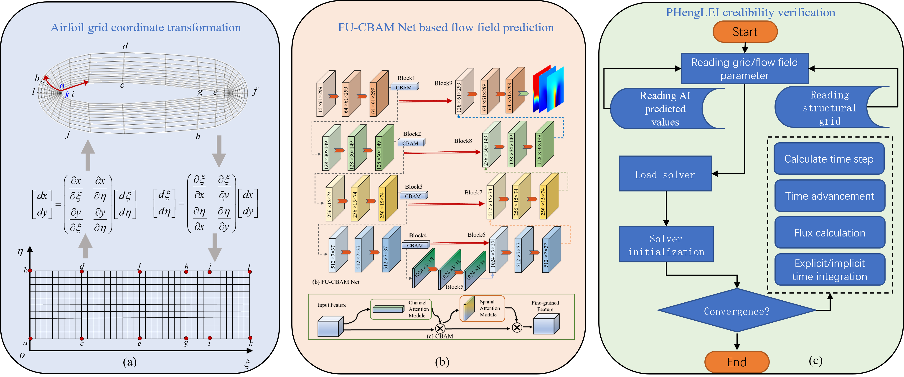
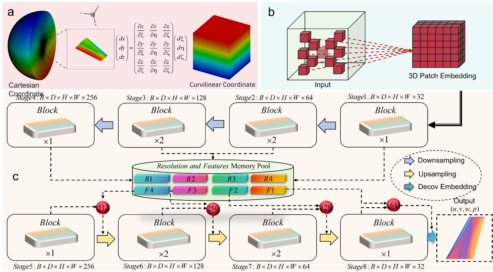

# Zuokuijun's Knowledge Repository

- Github Repository URL：https://github.com/zuokuijun/zuokuijun.github.io
- Online Reading URL：https://zuokuijun.github.io/#/

## Paper List

[1]  Fast sparse flow field prediction around airfoils via multi-head perceptron based deep learning architecture. 

 [paper]([Fast sparse flow field prediction around airfoils via multi-head perceptron based deep learning architecture - ScienceDirect](https://www.sciencedirect.com/science/article/abs/pii/S1270963822006162)) [code]([zuokuijun/Multi-head-attention-network: Multi-head attention network for airfoil flow field prediction](https://github.com/zuokuijun/Multi-head-attention-network))

[2] Fast aerodynamics prediction of laminar airfoils based on deep attention network

  [paper]([Fast aerodynamics prediction of laminar airfoils based on deep attention network | Physics of Fluids | AIP Publishing](https://pubs.aip.org/aip/pof/article-abstract/35/3/037127/2882158/Fast-aerodynamics-prediction-of-laminar-airfoils?redirectedFrom=fulltext)) [code]([zuokuijun/vitAirfoilEncoder: this repository mainly descript how use vision transfrmer encode airfoil to latent code](https://github.com/zuokuijun/vitAirfoilEncoder))

 

[3] Fast simulation of airfoil flow field via deep neural network

​    [paper](https://doi.org/10.1016/j.ast.2024.109207)  [code]([zuokuijun/FU-CBAM-Net: Fu-CBAM-Net deep learning model are used to predict airfoil flow filed](https://github.com/zuokuijun/FU-CBAM-Net))

 

[4] CycleMLP++: An efficient and flexible modeling framework for subsonic airfoils

​      [paper](https://doi.org/10.1016/j.eswa.2024.125455) 

[5] A rapid aerodynamic simulation framework for wide-speed-range airfoil flow fields

[6] 3DQLingNet: A deep learning framework for efficient simulation of three-dimensional wing     flow fields.

 

[7] Intelligent reconstruction method of airfoil flow field based on deep attention network. ICAS  2024.

  [paper]([ICAS2024_0852_paper.pdf](https://www.icas.org/ICAS_ARCHIVE/ICAS2024/data/papers/ICAS2024_0852_paper.pdf))
