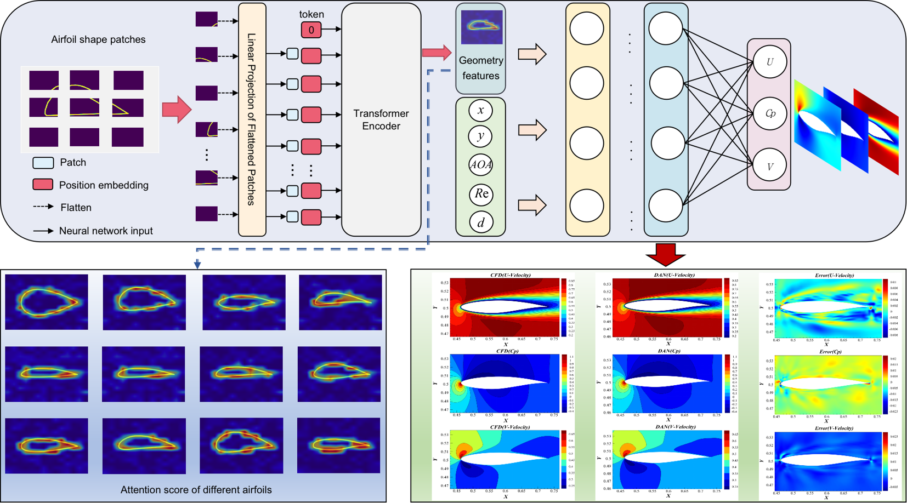

# Zuokuijun's Knowledge Repository

- Github Repository URL：https://github.com/zuokuijun/zuokuijun.github.io
- Gitee Repository URL:  https://zuokuijun.gitee.io/zuokuijun.github.io
- Online Reading URL：https://zuokuijun.github.io/#/

## Personal Profile

**School**：Northwestern Polytechnical University（NWPU）——Aircraft Intelligent Sensing and Control Laboratory

**Joint Training Unit**：China Aerodynamics Research and Development Center——State Key Laboratory of Aerodynamics      

**Research Direction**：Aerodynamics、Machine Learning

## Academic Achievements

【1】 [Fast sparse flow field prediction around airfoils via multi-head perceptron based deep learning architecture](https://www.sciencedirect.com/science/article/abs/pii/S1270963822006162)

In order to obtain the information about flow field, traditional [computational fluid dynamics](https://www.sciencedirect.com/topics/engineering/computational-fluid-dynamics) methods need to solve the Navier-Stokes equations on the mesh with boundary conditions, which is a time-consuming task. In this work, a data-driven method based on [convolutional neural network](https://www.sciencedirect.com/topics/engineering/convolutional-neural-network) and multi-head [perceptron](https://www.sciencedirect.com/topics/engineering/perceptron) is used to predict the incompressible laminar steady sparse flow field around the [airfoils](https://www.sciencedirect.com/topics/engineering/airfoil). Firstly, we use [convolutional neural network](https://www.sciencedirect.com/topics/engineering/convolutional-neural-network) to extract the geometry parameters of the airfoil from the input [gray scale image](https://www.sciencedirect.com/topics/engineering/grayscale-image). Secondly, the extracted [geometric parameters](https://www.sciencedirect.com/topics/engineering/geometric-parameter) together with [Reynolds number](https://www.sciencedirect.com/topics/engineering/reynolds-number), [angle of attack](https://www.sciencedirect.com/topics/engineering/angle-of-attack) and flow field coordinates are used as the input of the multi-layer [perceptron](https://www.sciencedirect.com/topics/engineering/perceptron) and the multi-head perceptron. The proposed multi-head [neural network architecture](https://www.sciencedirect.com/topics/engineering/neural-network-architecture) can predict the [aerodynamic coefficients](https://www.sciencedirect.com/topics/engineering/aerodynamic-coefficient) of the airfoil in seconds. Furthermore, the experimental results show that for sparse flow field, multi-head perceptron can achieve better prediction results than multi-layer perceptron.

【2】[Fast aerodynamics prediction of low-Reynolds-number airfoil based on deep attention network]()

 

