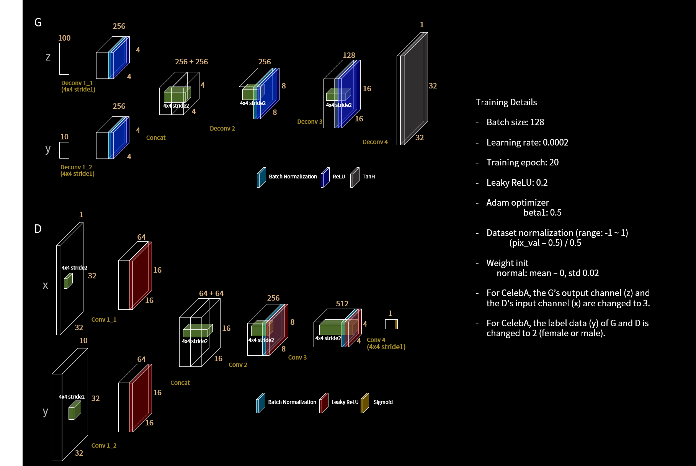

 # GAN --生成式对抗网络入门


 ```python
 import torch
import torch.nn  as nn
import  torch.nn.functional as F
import torch.optim as optim
import  numpy as  np
import  matplotlib.pyplot  as plt
import  torchvision
from  torchvision  import  transforms
from torch.utils.data  import DataLoader

# 根据设备是否支持显卡来选择需要运行的设备类型
device = 'cude' if torch.cuda.is_available() else 'cpu'
# 定义生成器
# 输入是长度为100的随机噪声(正态分布的随机数)
# 输出为随机生成的图片
class Generator(nn.Module):
     def __init__(self):
         super(Generator, self).__init__()

         self.main = nn.Sequential(
             nn.Linear(100, 256),
             nn.ReLU(),
             nn.Linear(256, 512),
             nn.ReLU(),
             nn.Linear(512, 28*28),
             nn.Tanh(),
         )
     def forward(self, x):
         x = self.main(x)
         x = x.view(-1, 1, 28, 28)
         return x

# 定义判别器
# 对真实的图片以及随机生成的图片进行打分评断
class Discriminator(nn.Module):
    def __init__(self):
        super(Discriminator, self).__init__()
        self.main = nn.Sequential(
            nn.Linear(28*28, 512),
            nn.LeakyReLU(),
            nn.Linear(512, 256),
            nn.LeakyReLU(),
            nn.Linear(256, 1),
            nn.Sigmoid(),
        )
    def forward(self, x):
        x = x.view(-1, 28*28)  # 将输入的图片展成一个MLP
        x = self.main(x)
        return x

def  gen_img_plot(model, test_input, epoch):
    prediction = np.squeeze(model(test_input).detach().cpu().numpy())
    fig = plt.figure(figsize=(4, 4))
    for i in range(16):
        plt.subplot(4, 4, i+1)
        plt.imshow((prediction[i]+1)/2)   # 将预测的输出结果限制在【0，1】
        plt.axis("off")
    plt.savefig("MNIST{}".format(epoch))


test_input = torch.randn(16, 100, device=device)
#-----------------------------------数据准备-------------------------------------
# 对数据做归一化【-1， 1】
transform = transforms.Compose(
    [transforms.ToTensor(),
     transforms.Normalize(0.5, 0.5)]
)
# 数据加载
train_data = torchvision.datasets.MNIST("data", train=True, transform=transform, download=True)
data = DataLoader(train_data, batch_size=64, shuffle=True)
#-------------------------------------------------------------------------------

G_loss = []
D_loss = []
# 初始化生成器
gen = Generator().to(device)
# 初始化判别器
dis = Discriminator().to(device)

# 定义模型的优化器
g_optim = optim.Adam(gen.parameters(), lr=0.0001)
d_optim = optim.Adam(dis.parameters(), lr=0.0001)

loss_fn = nn.BCELoss().to(device)

for epoch in range(20):
    d_epoch_loss = 0
    g_epoch_loss = 0
    count = len(data)   # 获得批次数目
    for train_data in data:
        imgs, label = train_data
        imgs = imgs.to(device)
        size = imgs.size(0)
        random_noise = torch.randn(size, 100, device=device)

        d_optim.zero_grad() # 将梯度归0
        real_output = dis(imgs)  # 判别器输入真实的图片
        d_real_loss = loss_fn(real_output,
                              torch.ones_like(real_output))  # 期望为预测的数值尽可能的接近于1
        d_real_loss.backward()

        gen_images = gen(random_noise)   # 生成器输出的图片
        fake_output = dis(gen_images.detach())
        d_fake_loss = loss_fn(fake_output,
                              torch.zeros_like(fake_output))  # 期望对生成器生成的图片尽可能的接近于0
        d_fake_loss.backward()

        d_loss = d_fake_loss + d_real_loss
        d_optim.step()

        g_optim.zero_grad()
        g_fake_output = dis(gen_images)
        g_loss = loss_fn(g_fake_output,
                         torch.ones_like(g_fake_output)) # 生成器在的损失，生成的损失能判定为1
        g_loss.backward()
        g_optim.step()

        with torch.no_grad():
            d_epoch_loss += d_loss
            g_epoch_loss += g_loss

    with torch.no_grad():
        d_epoch_loss /= count
        g_epoch_loss /= count
        D_loss.append(d_epoch_loss)
        G_loss.append(g_epoch_loss)
        print("Epoch:", epoch)
        gen_img_plot(gen, test_input, epoch)
 ```

 ## DCGAN(deep convolutional GAN)
 
 <p align="center">
 
 <p>

 ```python
 # -*- coding: utf-8 -*-
# @Time    : 2022/7/7 11:08 上午
# @Author  : zuokuijun
# @Email   : zuokuijun13@163.com

import torch
import torch.nn as nn
import torch.nn.functional as F
import torch.optim as  optim
import  numpy as  np
import  matplotlib.pyplot as plt
import  torchvision
import torchvision.transforms as  transform
from torch.utils.data import  DataLoader


# 加载数据集
#------------------------------------------------------------------
trans = transform.Compose([
    transform.ToTensor(),
    transform.Normalize(mean=0.5, std=0.5)
])

train_data = torchvision.datasets.MNIST('data',
                           train=True,
                           transform=trans,
                           download=True)
dataloader = DataLoader(train_data,
                        batch_size=64,
                        shuffle=True)
#------------------------------------------------------------------

# 定义生成器
class Generator(nn.Module):
    def __init__(self):
        super(Generator, self).__init__()
        self.linear1 = nn.Linear(100, 256*7*7)
        self.bn1 = nn.BatchNorm1d(256*7*7)
        self.deconv1 = nn.ConvTranspose2d(256, 128,
                                          kernel_size=(3, 3),
                                          stride=1,
                                          padding=1)  # 得到128*7*7的图像
        self.bn2 = nn.BatchNorm2d(128)
        self.deconv2 = nn.ConvTranspose2d(128, 64,
                                          kernel_size=(4, 4),
                                          stride=2,
                                          padding=1)  # 64*14*14
        self.bn3 = nn.BatchNorm2d(64)
        self.deconv3 = nn.ConvTranspose2d(64, 1,
                                          kernel_size=(4, 4),
                                          stride=2,
                                          padding=1) # 1*28*28
    def forward(self, x):
        x = F.relu(self.linear1(x))
        x = self.bn1(x)
        x = x.view(-1, 256, 7, 7)
        x = F.relu(self.deconv1(x))
        x = self.bn2(x)
        x = F.relu(self.deconv2(x))
        x = self.bn3(x)
        x = torch.tanh(self.deconv3(x))

        return x

# 定义判别器
class Discriminator(nn.Module):

    def __init__(self):
        super(Discriminator, self).__init__()
        self.conv1 = nn.Conv2d(1, 64, kernel_size=3, stride=2)
        self.conv2 = nn.Conv2d(64, 128, kernel_size=3, stride=2)
        self.bn = nn.BatchNorm2d(128)
        self.fc = nn.Linear(128*6*6, 1)

    def forward(self, x):
        x = F.dropout2d(F.leaky_relu(self.conv1(x)))
        x = F.dropout2d(F.leaky_relu(self.conv2(x)))
        x = self.bn(x)
        x = x.view(-1, 128*6*6)
        x = torch.sigmoid(self.fc(x))
        return x

# 初始化模型
device  =  "cuda"  if torch.cuda.is_available() else "cpu"
gen = Generator().to(device)
dis = Discriminator().to(device)

## 损失函数
loss_function = torch.nn.BCELoss()

## 定义优化器
g_optim = optim.Adam(gen.parameters(), lr=1e-4)
d_optim = optim.Adam(dis.parameters(), lr=1e-5)

def generate_save_images(model, epoch, test_inpput):
    predictions = np.squeeze(model(test_inpput).cpu().numpy())
    fig = plt.figure(figsize=(4, 4))
    for i in range(predictions.shape[0]):
        plt.subplot(4, 4, i+1)
        plt.imshow((predictions[i]+1)/2)
        plt.axis("off")
    plt.savefig("./DCGAN_MINST_results/{}".format(epoch))

# 用于生成模型的测试数据
test_input = torch.randn(16, 100, device=device)

D_loss = []
G_loss = []

for epoch in range(30):
    d_epoch_loss = 0
    g_epoch_loss = 0
    count = len(dataloader)
    for step, (img, _) in enumerate(dataloader):
        img = img.to(device)
        size = img.shape[0]
        random_noise = torch.randn(size, 100, device=device)
        d_optim.zero_grad()  # 将上述步骤的梯度归零，开始计算判别器的损失
        real_output = dis(img)
        d_real_loss = loss_function(real_output, torch.ones_like(real_output, device=device))
        d_real_loss.backward()  # 求解梯度

        # 求判别器在生成图像上的损失
        gen_img = gen(random_noise)
        fake_output = dis(gen_img.detach())
        d_fake_loss = loss_function(fake_output, torch.zeros_like(fake_output,device=device))
        d_fake_loss.backward()
        d_loss = d_real_loss + d_fake_loss
        d_optim.step()


        # 求解生成器的损失
        g_optim.zero_grad()
        fake_output = dis(gen_img)
        g_loss = loss_function(fake_output, torch.ones_like(fake_output, device=device))
        g_loss.backward()
        g_optim.step()

        with torch.no_grad():
            d_epoch_loss += d_loss.item()
            g_epoch_loss += g_loss.item()
    with torch.no_grad():
        d_epoch_loss /= count
        g_epoch_loss /= count
        D_loss.append(d_epoch_loss)
        G_loss.append(g_epoch_loss)
        generate_save_images(gen, epoch, test_input)
    print("Epoch:", epoch)
plt.plot(D_loss, label="Discriminator Loss")
plt.plot(G_loss, label="Generator Loss")
plt.legend()
plt.show()


 ```