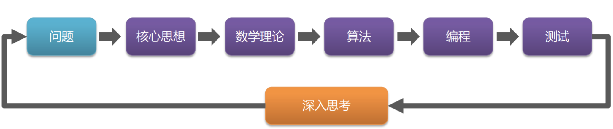

# K最近邻分类算法(K-Nearest Neighbor)--KNN

>[PI_Lab Machine Learning Notebook](https://gitee.com/pi-lab/machinelearning_notebook/blob/master/2_knn/knn_classification.ipynb)

简单来说，KNN可以看成：**有那么一堆你已经知道分类的数据，然后当一个新数据进入的时候，就开始跟训练数据里的每个点求距离，然后挑选这个训练数据最近的K个点，看看这几个点属于什么类型，然后用少数服从多数的原则，给新数据归类**。

  

该算法存在的问题：

1. 当样本不平衡时，如一个类的样本数量很大，而其他类样本数量很小时，有可能导致当输入一个新样本时，该样本的K个邻居中大数量类的样本占多数。在这种情况下可能会产生误判的结果。因此我们需要减少数量对运行结果的影响。可以采用权值的方法（和该样本距离小的邻居权值大）来改进。
2. 计算量较大，因为对每一个待分类的数据都要计算它到全体已知样本的距离，才能求得它的K个最近邻点。目前常用的解决方法是事先对已知样本点进行剪辑，事先去除对分类作用不大的样本。该算法比较适用于样本容量比较大的类域的自动分类，而那些样本容量较小的类域采用这种算法比较容易产生误分。

## 1. 算法步骤：

输入：

- 训练数据：$ T=(x_1,y_1),(x_2,y_2),...,(x_N,y_N)$, 其中$xi∈X=R_n$，$yi∈Y=0,1,...,K−1，i=1,2...N$
- 用户输入数据：$x_u$

输出：预测的最优类别$y_pred$

1. 准备数据，对数据进行预处理;

2. 计算测试数据与各个训练数据之间的**距离**；

3. 按照距离的递增关系进行排序；

4. 选取距离最小的`k`个点；

5. 确定前`k`个点所在类别的出现频率；

6. 返回前`k`个点中出现频率最高的类别作为测试数据的预测分类。

### 1.1 距离计算

   要度量空间中点与点之间距离的话，有好几种度量方式，比如常见的曼哈顿距离计算、欧式距离计算等等。不过通常 kNN 算法中使用的是欧式距离。这里只是简单说一下，拿二维平面为例，二维空间两个点之间的欧式距离计算公式如下：
$$
d=\sqrt{(x_2-x_1)^2+(y_2-y_1)^2}
$$
在二维空间其实就是计算 (x1,y1)(x1,y1) 和 (x2,y2)(x2,y2) 的距离。拓展到多维空间，则公式变成：
$$
d(p, q) = \sqrt{ (p_1-q_1)^2 + (p_1-q_1)^2 + ... + (p_n-q_n)^2 } = \sqrt{ \sum_{i=1,n} (p_i-q_i)^2}
$$

## 2. 机器学习的思维模型

针对kNN方法从原理、算法、到实现，可以得出机器学习的思维模型，在给定问题的情况下，是如何思考并解决机器学习问题。

上图是机器学习的经典的流程

- 问题：我们需要解决的问题是什么？
- 核心思想： 通过什么手段解决问题？
- 数学理论： 如何构建数学模型，使用什么数学方法？
- 算法： 如何将数学理论、处理流程转化成计算机可以实现的算法？
- 编程： 如何把算法变成可以计算机执行的程序？
- 测试: 如何使用训练、测试数据来验证算法
- 深入思考：所采用的方法能够取得什么效果，存在什么问题，如何改进？

## 3、编程实现

