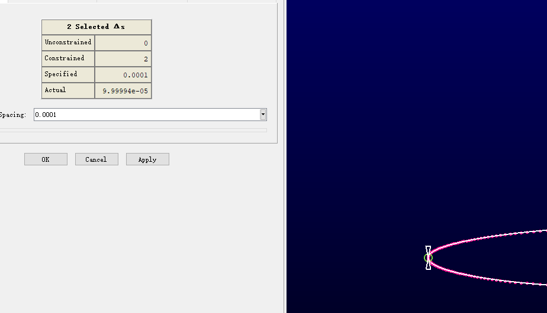

# RAE2822 翼型的网格划分与求解器求解
参考：[RAE2822翼型网格划分](https://www.bilibili.com/video/BV1xg411T7xF/?spm_id_from=333.788.recommend_more_video.2&vd_source=43aa05a83871947f1aa864b1246b7e14)

[pointwise 建立二维翼型流场网格](http://www.doczj.com/doc/5a6063876-4.html)

[https://www.bilibili.com/video/BV1wB4y1i7Aa/?spm_id_from=333.788.recommend_more_video.1&vd_source=43aa05a83871947f1aa864b1246b7e14](https://www.bilibili.com/video/BV1wB4y1i7Aa/?spm_id_from=333.788.recommend_more_video.1&vd_source=43aa05a83871947f1aa864b1246b7e14)

---

## 一、RAE2822翼型的网格划分

* 导入的网格文件格式为：

    120（翼型坐标数量）

    X Y Z （翼型坐标数据）

* File >> Import >> Database

* 选中翼型， 使用快捷键 Ctrl + Q 将翼型根据坐标点(0 0 0)以及(1 0 0)分为上下两个部分

* 将翼型转换为Connector类型， 并且从view 工具栏中将Database隐藏，仅对线网格进行处理

* 对翼型的上下曲线分配网格点

* 调整翼型前缘以及后缘的网格分配

* 在翼型后缘添加辅助线
利用快捷键 Ctrl + shift + 滚轮 可以测量两个数据点之间的距离， 然后保证辅助线与翼型后缘的网格点的间距大小是一样的。

* 画出边界层曲线的结构化网格

     Creat > Extrude > Normal
  
    点击Assemble special> Delete All Edges 重新进行边的设置。
    
    设置边界层的相关参数
    

    
    

    设置边界条件
    

    
    

    网格生成
    

    
    

* 画出边界层与压力远场之间的非结构化网格
  

    
    

* 设置求解器、边界条件，然后导出网格数据

Viscosity: 1.983e-05
X:         0.9988147
Y:         0.04867544
P:         43765
Ma:        0.73

Density: 0.5082372

[RAE2822 跨声速流场求解](http://www.360doc.com/content/18/1128/14/50625244_797791736.shtml)

