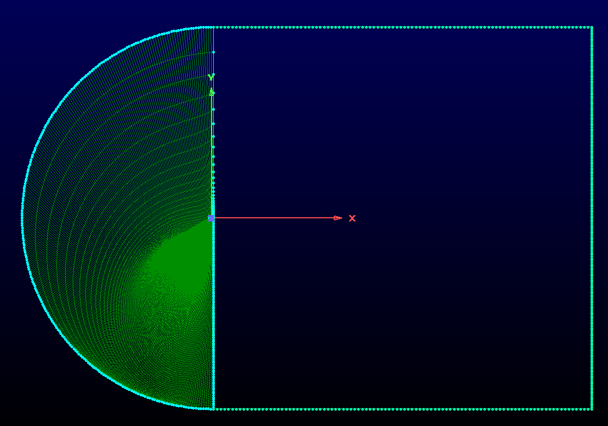
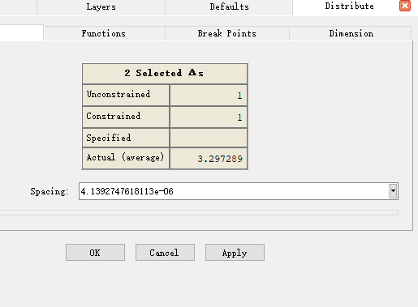

# RAE2822 翼型的网格划分与求解器求解
参考：[RAE2822翼型网格划分](https://www.bilibili.com/video/BV1xg411T7xF/?spm_id_from=333.788.recommend_more_video.2&vd_source=43aa05a83871947f1aa864b1246b7e14)

[pointwise 建立二维翼型流场网格](http://www.doczj.com/doc/5a6063876-4.html)

[https://www.bilibili.com/video/BV1wB4y1i7Aa/?spm_id_from=333.788.recommend_more_video.1&vd_source=43aa05a83871947f1aa864b1246b7e14](https://www.bilibili.com/video/BV1wB4y1i7Aa/?spm_id_from=333.788.recommend_more_video.1&vd_source=43aa05a83871947f1aa864b1246b7e14)

[https://zhuanlan.zhihu.com/p/61451821](https://zhuanlan.zhihu.com/p/61451821)
[https://www.grc.nasa.gov/www/wind/valid/raetaf/raetaf05/raetaf05.html](https://www.grc.nasa.gov/www/wind/valid/raetaf/raetaf05/raetaf05.html)

[RAE2822试验结果对比--Case6](https://www.grc.nasa.gov/www/wind/valid/raetaf/raetaf05/cp.exp.gen)

>>>Case 6 风洞试验结果
M_infty = 0.729, alpha = 2.31 deg.
X / C
Cp
1

  103
0.9938 -0.1432
0.9875 -0.1318                                                            
0.9750 -0.1082                                                            
0.9500 -0.0592                                                            
0.9250 -0.0115                                                            
0.9000  0.0365                                                            
0.8750  0.0808                                                            
0.8500  0.1296                                                            
0.8250  0.1746                                                            
0.8000  0.2186
0.7750  0.2702                                                            
0.7500  0.3029                                                            
0.7000  0.3913                                                            
0.6771  0.4263                                                            
0.6500  0.4778                                                            
0.6196  0.5361                                                            
0.6000  0.5798                                                            
0.5750  0.6769                                                            
0.5500  0.9137                                                            
0.5250  1.2201                                                            
0.5000  1.2164                                                            
0.4750  1.2038                                                            
0.4500  1.1940                                                            
0.4250  1.1819                                                            
0.4000  1.1601                                                            
0.3750  1.1490                                                            
0.3500  1.1273                                                            
0.3250  1.1168                                                            
0.3000  1.1091                                                            
0.2800  1.1010                                                            
0.2500  1.0736                                                            
0.2208  1.0456                                                            
0.2000  1.0433                                                            
0.1500  1.0096                                                            
0.1000  0.9886                                                            
0.0750  1.0432                                                            
0.0625  1.0730                                                            
0.0500  1.0923                                                            
0.0375  1.0820                                                            
0.0271  1.0435                                                            
0.0187  1.0362                                                            
0.0146  0.9204                                                            
0.0125  0.8680                                                            
0.0104  0.8041                                                            
0.0087  0.7658                                                            
0.0073  0.7250                                                            
0.0060  0.6269                                                            
0.0048  0.5309                                                            
0.0036  0.4667                                                            
0.0026  0.2746                                                            
0.0016  0.0521                                                            
0.0008 -0.1042                                                            
0.0002  0.4219                                                            
0.0000 -0.8328                                                            
0.0002 -1.0396                                                            
0.0008 -1.1053                                                            
0.0016 -1.1338                                                            
0.0026 -1.1223                                                            
0.0036 -1.0823                                                            
0.0048 -1.0273                                                            
0.0060 -0.9736                                                            
0.0073 -0.9148                                                            
0.0087 -0.8703                                                            
0.0104 -0.8148                                                            
0.0125 -0.7537                                                            
0.0146 -0.6980                                                            
0.0186 -0.6159                                                            
0.0271 -0.5444                                                            
0.0375 -0.4040                                                            
0.0500 -0.3088                                                            
0.0625 -0.2454                                                            
0.0750 -0.1926                                                            
0.1000 -0.1042                                                            
0.1500  0.0081                                                            
0.2000  0.0940                                                            
0.2500  0.1754                                                            
0.3000  0.2506                                                            
0.3250  0.2904                                                            
0.3500  0.3214                                                            
0.3750  0.3406                                                            
0.4000  0.3403                                                            
0.4250  0.3194                                                            
0.4500  0.2881                                                            
0.4750  0.2469                                                            
0.5000  0.2079                                                            
0.5250  0.1657                                                            
0.5500  0.1169                                                            
0.5750  0.0731                                                            
0.6000  0.0301                                                            
0.6196  0.0003                                                            
0.6500 -0.0431                                                            
0.6771 -0.0836                                                            
0.7000 -0.1134                                                            
0.7500 -0.1731                                                            
0.7750 -0.1988                                                            
0.8500 -0.2618                                                            
0.8750 -0.2778                                                            
0.9000 -0.2907                                                            
0.9250 -0.2972                                                            
0.9500 -0.2937                                                            
0.9750 -0.2676                                                            
0.9875 -0.2396                                                            
0.9938 -0.2146             
>>>
---

## 一、RAE2822翼型结构化网格划分

* 导入的网格文件格式为：

    120（翼型坐标数量）

    X Y Z （翼型坐标数据）

* File >> Import >> Database

* Edit >> Smooth  对翼型的前缘做平滑处理，这里设置的平滑参数为`0.0001`

* 选中翼型， 使用快捷键 Ctrl + Q 将翼型根据坐标点(0 0 0)以及(1 0 0)分为上下两个部分

* 将翼型转换为Connector类型， 并且从view 工具栏中将Database隐藏，仅对线网格进行处理

* 对翼型的上下曲线分配网格点

* 调整翼型前缘的网格分布。选中翼型，选择快捷键Ctrl+G调整翼型前缘的网格分布, 这里将每个分布点之间的间距调整为0.0001

* 画C结构网格。画出基本的几何外形，并对其分配相应的节点

  

  
  

* Create >> Assemble special >> domain  生成结构网格

     

     
     

* 生成边界层，设置生长率与生成的层数

  

  
  

* 保证网格质量， 对交叉的位置做边界层生成，最后的位置点的分布直接从翼型的后缘位置拷贝得到

  

  
  

* 翼型的结构化网格最终如下图所示

  

  
  

* 需要注意在正式导出网格数据之前，需要将确认网格方向，需要反置的话导出网格会失败

  

  
  

Viscosity: 1.983e-05
X:         0.9988147
Y:         0.04867544
P:         43765
Ma:        0.73

Density: 0.5082372

[RAE2822 跨声速流场求解](http://www.360doc.com/content/18/1128/14/50625244_797791736.shtml)

