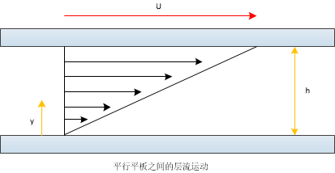

#  流体的连续性、黏性与可压缩性

>**前言**：空气动力学是研究空气与物体之间有相对运动时，空气的运动规律和作用力所服从规律的一门学科。按照飞行马赫数（定义为飞行速度与声速的比值，Ma=V/a），可将飞行器空气动力学分为低速空气动力学（Ma<0.3）、亚声速空气动力学（0.3<=Ma<0.8）、跨声速空气动力学（0.8<=Ma<=1.2）、超声速空气动力学（1.2<Ma<5）以及高超声速空气动力学（Ma>=5）。现有空气动力学的研究方法主要分为三类：理论分析方法、试验方法（风洞试验、飞行试验）以及数值方法（有限差分法、有限体积法、有限元以及谱分解方法）
>
>参考：《空气动力学基础》（曾明、刘伟、邹建军编） 、《我所理解的流体力学》（王宏伟编） 

## 一、流体的连续性

​		欧拉在1753年提出了连续介质假设，认为流体充满一个体积时是不留任何间隙的，流体的特征也是连续变化的。如果从数学上描述连续介质假设，则是：假设$f(x,t)$ 代表时刻$t$位于$x$处介质的某些性质，那么它们都是$(x,t)$的连续函数，而且可以微分多次。由于分子间存在间隙，且分子本身在作随机运动，分子之间碰撞频繁，所以从微观角度来看，流体的物理量随时间和空间的变化都是不连续的，这是流体的`微观特性`。但是若将研究对象扩大到“大量分子的集合”，按分子运动论的观点“集合”性质表现为分子的统计特性。只要“集合”包含的分子数足够多，其物理量的统计平均值在时间上是确定的，在空间上是连续的，这是流体的`宏观特性`。

​		 连续介质模型描述为：流体是由连续分布的流体质点所组成的，流体流动空间中每一点都被相应的流体质点占据。而空间任意点上的流体物理量（如密度、温度、速度等）就是指位于该点流体质点的物理量。（**Tips:在80Km高空以及讨论激波问题时，此时需要考虑连续介质假设的适用性**）

## 二、流体的黏性

​	静止流体不能承受切应力。如果受到切应力作用，流体就会连续变形，表现出流动性：而流体一旦运动，流体内部就具有抵抗剪切变形的特性，以内摩擦力的形式抵抗流层之间的相对运动，这就是`黏性`。

​	`单位面积上的黏性摩擦力称为黏性切应力`。取$y$位置上厚度为$dy$的薄层，薄层下表面的流速为$u$，上表面的流速为$u+du$，则该薄层内流体之间的切应力为:
$$
\tau = \mu \frac{u+du-u}{dy}=\mu \frac{du}{dy}
$$
上述公式也称为牛顿黏性切应力公式。牛顿黏性切应力公式给出了切应力与速度梯度之间的线性关系，满足这种关系的流体称为牛顿流体。比如空气、水等都是牛顿流体。油漆、牙膏、血液等都是非牛顿流体。$\mu$表示黏度，黏度反映了流体抵抗剪切应变率的能力，是介质的自身属性，与流体是否存在宏观运动无关。许多实际流动都是符合“无黏流体”近似条件的。如对于边界层而言，边界层内速度梯度很大，流体显示出较大的黏性力；而在边界层外，流体的速度梯度很小因而黏性力也小，可略去黏性影响，采用无黏流体模型。`需要注意的是，将流体在边界层内视为黏性流体，而在边界层外视为无黏流体，并不是说流体的黏性在边界层外比边界层内小的多，而是黏性力（黏度与速度梯度的乘积）在边界层外比边界层内小的多。`

    

## 三、流体的可压缩性

​	`压缩性是指对于一定量的物质其体积的改变程度，或者其密度的改变程度。`一般认为气体在小于0.3Ma时密度变化很小，可以按照不可压缩处理。低速时将气体视为不可压气体，是因为气体的压强变化小，因而密度变化小到可以忽略，是一种抽象近似模型，因此，低速流动又可称为不可压缩流动。但是在高速运动的气流中将出现很大的压力梯度，需要考虑密度的变化及其对流动产生的影响，所以高速时，必须将气体视为可压缩气体。

