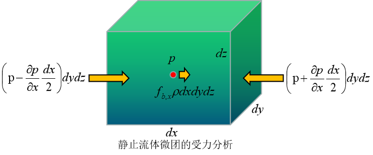

# 欧拉静平衡方程

    

`流体的静止状态指的是流体各部分之间没有相对运动，或者说流体的形状不发生改变的状态。`

如上图所示，在静止的流体内部取一个六面体，让其六个面分别垂直于三个坐标轴。沿三个方向的边长分别为$dx,dy,dz$，于是该六面体的体积为$dxdydz$，质量为$\rho dx dy dz$。如果用$F_b$表示体积力，用$f_b$表示单位质量的[体积力](../docs/momentum.md)，则有如下关系式：
$$
\overrightarrow{F_b} = \overrightarrow{f_b}\rho dxdydz
$$
假设流体微团中心处的压力为P，则其左侧面上的压力小于这个数值，右侧面上的压力大于这个数值，应用泰勒展开，并忽略二阶以上小量后，左右侧面的压力可以分别写为：
$$
p_{left}=p-\frac{\partial p}{\partial x} \frac{dx}{2};   \quad p_{right}=p+\frac{\partial p}{\partial x}\frac{dx}{2}
$$
上述式子中，$\frac{\partial p}{\partial x}$表示压力沿x方向的变化率。也称为沿x方向的压力梯度。进一步，可得出力的平衡关系式：
$$
f_{b,x} \rho dxdydz+(p-\frac{\partial p}{\partial x} \frac{dx}{2})dydz - (p+ \frac{\partial p}{\partial x} \frac{dx}{2})dydz = 0
$$
化简后得：
$$
\frac{\partial p}{\partial x}=\rho f_x \quad
进一步得到： \\ \frac{\partial p}{\partial y}=\rho f_y  \qquad
\frac{\partial p}{\partial z}=\rho f_z
$$
将上述式子写成矢量形式为：
$$
\nabla p = \rho f
$$
上述式子描述了流体微团在静止状态下的受力平衡时压强、密度和单位质量的彻体力之间的关系。

