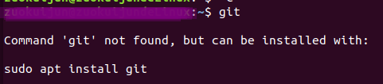
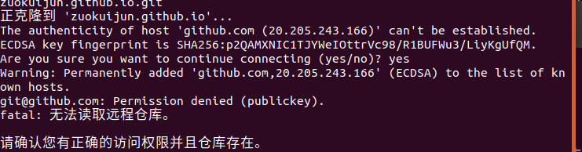
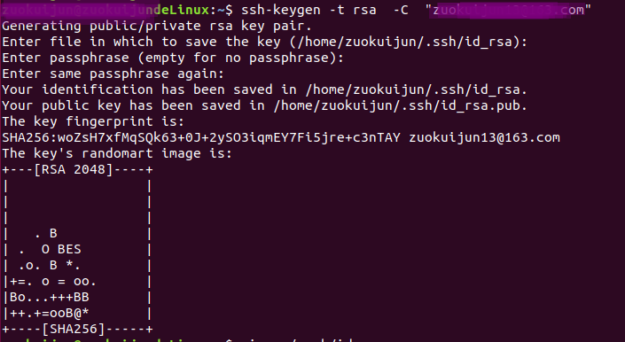
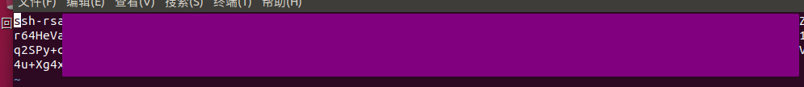

# Git 的安装与Github配置教程

1、这里主要是基于`Linux平台`演示`git`的安装与配置过程

2、首先在终端输入`git`命令，如果弹出如下信息说明系统`git`没有安装，通过命令`sudo apt  install  git`安装`git`

    

3、安装完成后，在终端再次输入git，显示如下信息说明git安装成功

    

4、配置git基本信息：

		*   `git   config   --global   user.name   "具体用户名" `
		*    `git   config  --global  user.email   "具体邮箱地址"`

 5、生成公钥与私钥，用于从代码仓库如Gitee、Github拉取代码或者上传代码，若仓库没有添加公钥，直接拉取代码会提示如下错误

    

6、在终端输入`ssh-keygen   -t    rsa   -C    "具体邮箱地址"`，回车三次生成公钥与私钥

    

7、根据公钥地址，打开文件 vim  ~/.ssh/id_rsa.pub ，该文件应该是以ssh-rsa开头的公钥

    

8、将其添加到github SSH keys 的位置， 配置完成此时就可以从github拉取代码或者将代码推送到github仓库

    

