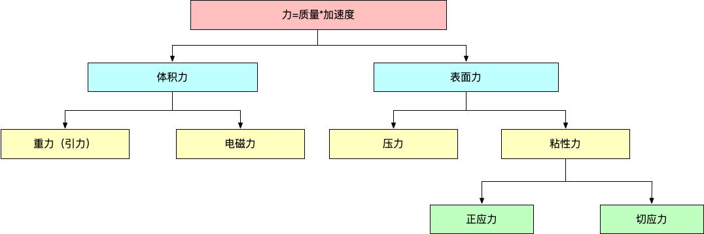
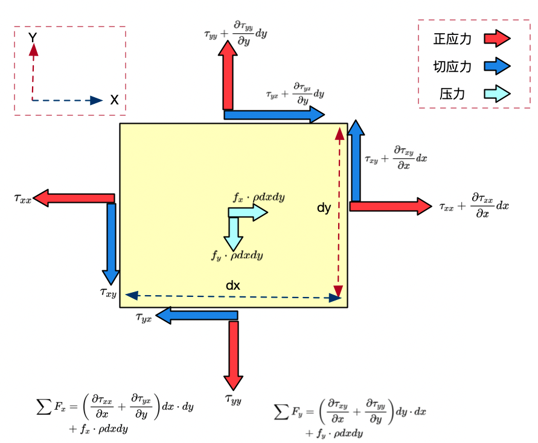
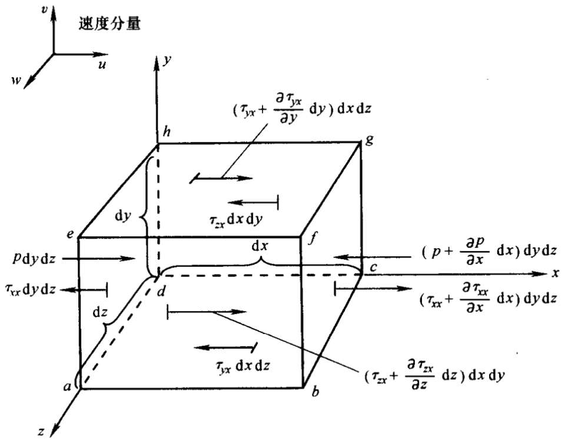

# 动量方程的推导

>参考文献
>
>计算流体力学基础及其应用（美.约翰.安德森）——p54
>
>李东岳——无痛苦NS方程——p34
>
>北京航空航天大学——王洪伟（我所理解的流体力学）

本节主要是基于牛顿第二定律:$F=ma$对动量方程进行推导。为了方便推导，这里主要选取运动的无穷小流体微团为研究对象，无穷小的流体微团在运动过程中主要受体积力以及表面力的作用。表面力，顾名思义就是作用在无穷小微团表面的力，如压力、表面张力、粘性力（正应力、切应力）等；体积力作用在无穷小微团全部体积上（不仅表面有、体积内也有），例如重力、电磁力、电场力等。主要的分类如下图所示。

#### 无穷小流体微团在运动中主要受到两种表面力的作用：

**1）由流体微团周围的流体作用于流体微团表面的压力分布；**

**2）由于外部流体推拉流体微团而产生的，以摩擦的方式作用于表面的切应力以及正应力分布。**

为了便于理解，这里首先给出二维流体微团的受力分析，然后在此基础上将其扩展到三维流体微团。如下图所示，一个流体微团受到的表面力主要有压力以及粘性力，而粘性力根据方向又可以分为**正应力**以及**切应力**。这里的分量存在两个下标，第一个下标表示作用于与某方向垂直的平面，第二个下标表示力的方向。根据下图的受力分析，最终可以分别得到对应X方向以及Y方向的合力。具体的推导过程如下图所示。

根据二维流体微团的受力分析，可以相应的扩展到三维的流体微团。根据牛顿第二定律，作用于微团上力的总和等于微团的质量乘以微团运动时的加速度。将其沿着X、Y、Z轴分解为三个标量的关系式，首先我们仅考虑其中X方向的分量。$F_x=ma_x$，这里我们首先考虑X方向所受的力。将作用在单位质量流体微团上的体积力记作$f$，其$x$方向的分量为$f_x$。流体微团的体积为$dxdydz$，从而作用在流体微团上的`体积力`$x$方向上的分量为：
$$
F_x = \rho f_x(dxdydz)
$$
如下图所示，在面$abcd$上，仅存在由切应力引起的$x$方向的分力$\tau_{yx}d_xd_z$，面$efgh$与面$abcd$的距离为$d_y$，所以根据泰勒公式可得到面$efgh$上$x$方向的切应力为$[\tau_{yx}+(\frac{\partial \tau_{yx}}{\partial y})dy]dxdz$。这里需要说明的是，两个面上的方向是不同的。在底面，$\tau_{yx}$是向左的（与X轴方向相反）；在顶面，切应力的方向是向右的（与X轴的方向相同）。即速度三个分量$u,v,w$的正增量与坐标轴的正向一致。例如，对于平面$efgh$来说，因为$u$沿着$Y$轴的正向是增加的，所以在稍高于平面$efgh$的位置，速度要比平面上的大。于是就形成了“拉”的动作，试图将流体微团向右拉向$X$轴的正向，与此相反，考虑abcd平面，则在稍微低于该平面的位置，速度要比平面上的小，于是对流体微团就形成了阻滞的作用，方向为X轴的负向。特别是在面$dcgh$上，$\tau_{zx}$指向X轴的负方向；而在面$abfe$上，$\tau_{zx}+(\frac{\partial \tau_{zx}}{\partial z})dz$指向X轴正向。在垂直于X轴的面$adhe$上，X方向的力有压力$pdxdz$，指向流体微团的内部，还有沿着X轴负向的应力$\tau_{xx}dydz$。

综上所述，对运动的流体微团，X方向总的表面力：
$$
[p-(p+\frac{\partial p}{\partial x})]dydz+[(\tau_{xx}+\frac{\partial \tau_{xx}}{\partial x}dx)-\tau_{xx}]dydz+[(\tau_{yx}+\frac{\partial \tau_{yx}}{\partial y}dy)-\tau_{yx}]+[(\tau_{zx}+\frac{\partial \tau_{zx}}{\partial z}dz)-\tau_{zx}]dxdy
$$
加上体积力，有：
$$
F_x=(-\frac{\partial p}{\partial x}+\frac{\partial \tau_{xx}}{\partial x}+\frac{\partial \tau_{yx}}{\partial y}+\frac{\partial \tau_{zx}}{\partial z})dxdydz+\rho f_xdxdydz
$$
因为这里我们考虑的是运动的流体微团，其质量是固定不变的，即：
$$
m=\rho dxdydz
$$
另外，我们知道流体微团的加速度就是速度变化的时间变化率。所以，加速度的x方向的分量，记作$a_x$，等于直接就是$u$的时间变化率。这里我们直接根据物质导数的定义，即：
$$
a_x=\frac{D_u}{D_t}
$$
这里将上述得到的结果带入牛顿第二定律中，得到：
$$
x 方向动量方程：\rho \frac{D_u}{D_t}=-\frac{\partial \rho}{\partial x}+\frac{\partial \tau_{xx}}{\partial x}+\frac{\partial \tau_{yx}}{\partial y}+\frac{\partial \tau_{zx}}{\partial z}+\rho f_x \\
y方向的动量方程:\rho \frac{D_v}{D_t}=-\frac{\partial \rho}{\partial y}+\frac{\partial \tau_{xy}}{\partial x}+\frac{\partial \tau_{yy}}{\partial y}+\frac{\partial \tau_{zy}}{\partial z}+\rho f_y \\
z方向的动量方程:\rho \frac{D_w}{D_t}=-\frac{\partial \rho}{\partial z}+\frac{\partial \tau_{xz}}{\partial x}+\frac{\partial \tau_{yz}}{\partial y}+\frac{\partial \tau_{zz}}{\partial z}+\rho f_z \\
$$
因为上述推导是基于运动的流体微团得到的，因此上述方程组是非守恒的，为了纪念法国人`M.Navier`和英国人`G.Stokes`，上述方程统称为纳维-斯托克斯方程，也就是大家所熟知的NS方程。那如何得到守恒的NS方程呢？继续往下讨论。。。 。。。

