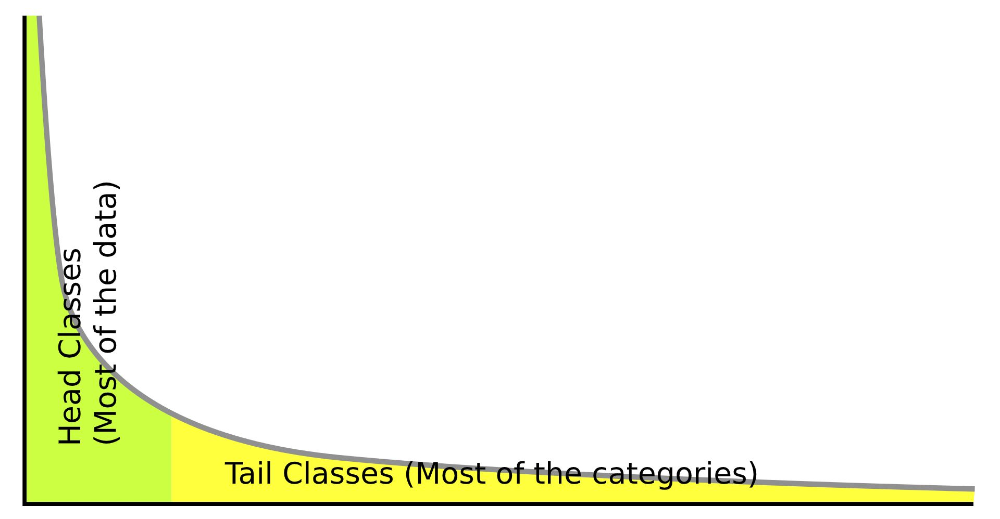
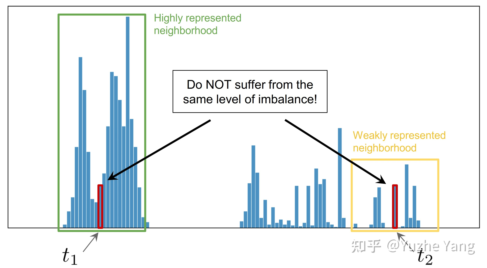
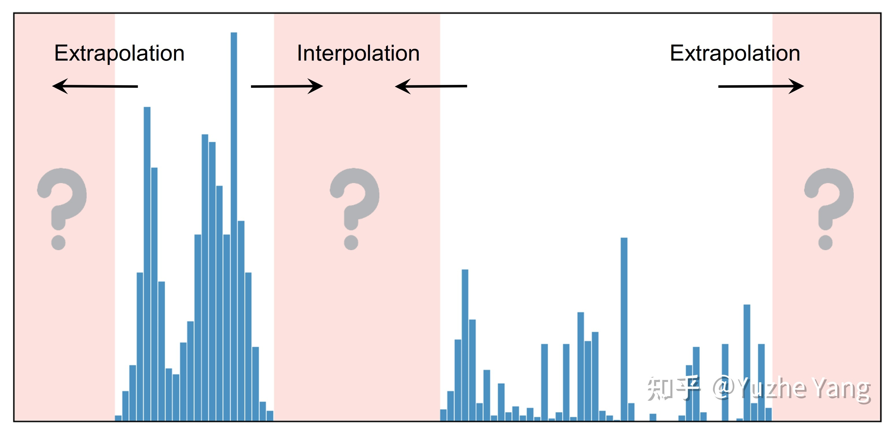

#  多任务学习中，关于数据不均衡问题的一点思考

> 参考文献：https://zhuanlan.zhihu.com/p/369627086     **[Delving into Deep Imbalanced Regression](https://link.zhihu.com/?target=https%3A//arxiv.org/abs/2102.09554)**
>
>    https://www.zhihu.com/question/372186043/answer/1501948720

数据不平衡在现实世界中是无处不在。现实数据通常不会是每个类别都具有理想的均匀分布，而是呈现出尾巴较长的偏斜分布，其中某些目标值的观测值明显较少。这种现象对深度模型提出了巨大挑战，并激发出了许多解决数据不平衡问题的方法、技术。

    

## 一、不平衡回归问题的难点与挑战

**（一）**首先，给定连续的，并且可能无穷多的目标值，**类与类之间的hard boundaries便不再存在**。那么当直接应用传统的不平衡分类方法，例如重采样或重加权，因其是对于特定的离散的类别进行操作，这就导致了这些方法不直接适用于连续域的情况。

**（二）**此外，连续标签本质上**在不同目标值之间的距离是具有意义的**。这些目标值（标签）直接告诉了我们，哪些数据相隔更近，而哪些相隔更远；而这个有意义的距离，会进一步指导我们该如何理解这个连续区间上的数据不平衡的程度。例如，假设有两个目标标签t1和 t2 ，它们在训练数据中具有同样的sample数量，然而， t1 位于一个具有高密度数据的邻域中（在该邻域范围内有许多样本），而t2位于一个低密度数据的邻域中。那么在这种情况下，t1和t2并不具有相同程度的数据不平衡。

    

**（三）**最后，与分类问题不同，对于DIR，**某些目标值可能就根本没有数据**。而这也激发了对目标值做 **extrapolation** 以及 **interpolation** 的需求。

    

## 二、 数据不平衡问题的解决思路

1、**重采样（re-sampling）**：这是解决数据类别不平衡的非常简单而暴力的方法，更具体可以分为两种，对少样本的**过采样**[[1\]](#ref_1)，或是对[多样本](https://www.zhihu.com/search?q=多样本&search_source=Entity&hybrid_search_source=Entity&hybrid_search_extra={"sourceType"%3A"answer"%2C"sourceId"%3A1501948720})的**欠采样**[[2\]](#ref_2)。当然，这类比较经典的方法一般效果都会欠佳，因为过采样容易[overfit](https://www.zhihu.com/search?q=overfit&search_source=Entity&hybrid_search_source=Entity&hybrid_search_extra={"sourceType"%3A"answer"%2C"sourceId"%3A1501948720})到minor classes，无法学到更鲁棒易泛化的特征，往往在非常不平衡的数据上泛化性能会更差；而欠采样则会直接造成major class严重的信息损失，甚至会导致欠拟合的现象发生。

https://zhuanlan.zhihu.com/p/153483585

2、**数据合成（synthetic samples）**：若不想直接重复采样相同样本，一种解决方法是生成和少样本相似的“新”数据。一个最粗暴的方法是直接对少类样本加随机高斯噪声，做data smoothing[[3\]](#ref_3)。此外，此类方法中比较经典的还有SMOTE[[4\]](#ref_4)，其思路简单来讲是对任意选取的一个少类的样本，用K近邻选取其相似的样本，通过对样本的[线性插值](https://www.zhihu.com/search?q=线性插值&search_source=Entity&hybrid_search_source=Entity&hybrid_search_extra={"sourceType"%3A"answer"%2C"sourceId"%3A1501948720})得到新样本。说道这里不禁想到和mixup[[5\]](#ref_5)很相似，都是在input space做数据插值；当然，对于deep model，也可以在representation上做mixup（manifold-mixup）。基于这个思路，最近也有imbalance的mixup版本出现[[6\]](#ref_6)。

3、**重加权（re-weighting）**：顾名思义，重加权是对不同类别（甚至不同样本）分配不同权重，主要体现在重加权不同类别的loss来解决长尾分布问题。注意这里的权重可以是自适应的。此类方法的变种有很多，有最简单的按照类别数目的倒数来做加权[[7\]](#ref_7)，按照“有效”样本数加权[[8\]](#ref_8)，根据样本数优化分类间距的loss加权[[9\]](#ref_9)，等等。对于max margin的这类方法，还可以用[bayesian](https://www.zhihu.com/search?q=bayesian&search_source=Entity&hybrid_search_source=Entity&hybrid_search_extra={"sourceType"%3A"answer"%2C"sourceId"%3A1501948720})对每个样本做uncertainty估计，来refine决策边界[[10\]](#ref_10)。这类方法目前应该是使用的最广泛的，就不贴更多的reference了，可以看一下这个[survey paper](https://www.zhihu.com/search?q=survey+paper&search_source=Entity&hybrid_search_source=Entity&hybrid_search_extra={"sourceType"%3A"answer"%2C"sourceId"%3A1501948720})[[3\]](#ref_3)。

4、**迁移学习（transfer learning）**：这类方法的基本思路是对多类样本和少类样本分别[建模](https://www.zhihu.com/search?q=建模&search_source=Entity&hybrid_search_source=Entity&hybrid_search_extra={"sourceType"%3A"answer"%2C"sourceId"%3A1501948720})，将学到的多类样本的信息/表示/知识迁移给少类别使用。代表性文章有[[11\]](#ref_11)[[12\]](#ref_12)。

5、**度量学习（metric learning）**：本质上是希望能够学到更好的embedding，对少类附近的boundary/margin更好的建模。有兴趣的同学可以看看[[13\]](#ref_13)[[14\]](#ref_14)。这里多说一句，除了采用经典的contrastive/triplet loss的思路，最近火起来的contrastive learning，即做instance-level的discrimination，是否也可以整合到不均衡学习的框架中？

6、**元学习/域自适应（meta learning/domain adaptation）**：这部分因为文章较少且更新一点，就合并到一起写，最终的目的还是分别对头部和尾部的数据进行不同处理，可以去自适应的学习如何重加权[[15\]](#ref_15)，或是formulate成域自适应问题[[16\]](#ref_16)。

7、**解耦特征和分类器（decoupling representation & classifier）**：最近的研究发现将特征学习和分类器学习解耦，把不平衡学习分为两个阶段，在特征学习阶段正常采样，在分类器学习阶段平衡采样，可以带来更好的长尾学习结果[[17\]](#ref_17)[[18\]](#ref_18)。

## 三、半监督与自监督的解决思路 https://zhuanlan.zhihu.com/p/259710601

https://link.zhihu.com/?target=https%3A//github.com/YyzHarry/imbalanced-semi-self

## 四、标签或者特征的平滑处理

https://zhuanlan.zhihu.com/p/369627086

**[Delving into Deep Imbalanced Regression](https://link.zhihu.com/?target=https%3A//arxiv.org/abs/2102.09554)**

## 五、训练模型的处理

https://www.zhihu.com/question/425243050/answer/2442362433

## 六、损失函数的处理

如Balanced MSE: https://zhuanlan.zhihu.com/p/501956790
