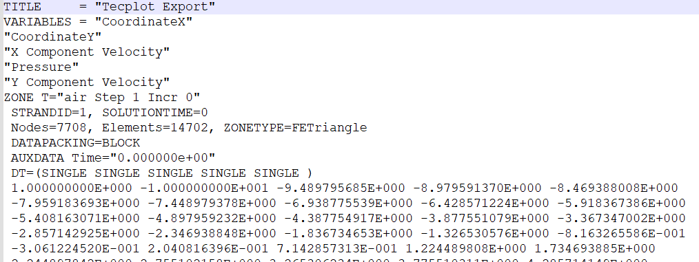

# Tecplot 教程

###  一、 调整图像基本属性

* 调整画布大小

  打开一个图像，此时图像基本会填满整个窗口，通过双击画布的边缘，可以调整画布的大小、名称、是否显示边缘、是否显示背景等

  

      
  

 * 图例与图像数据标号

   `plot >  symbol font`  可以调整字体类型

   `plot >  Line Legend`  可以控制图像是否显示图例

   `plot >  label points  and cells`   控制图像的每个数据点是否显示标号 

   

       
   

   
   
 * 坐标轴的调整

   双击图像中的坐标轴，可以弹出图像坐标轴属性设置窗口

   `Area:`   控制整个坐标轴在画布中的位置

   `Range:` 调整X、Y轴数据的显示范围

   `Grid: ` 控制图像是否显示网格线

   `Ticks:` 用于调整主、副标尺大小

   `Labels:` 用于调整标尺上数字的属性比如大小、颜色、字体信息

   `Title:`  用于调整图像横纵坐标字符的属性比如字体、大小、颜色信息

   `Line:` 用于调整图像横纵坐标线的属性，比如颜色、深浅等

   

       
   

   
   
 * 曲线属性的设置

   双击曲线，可以弹出曲线属性设置界面。

   `Lines:` 设置曲线的颜色、粗细以及线型等信息

   `Symbols: `设置数据点的颜色、数据点类型以及线型等信息

   

       
   

### 二、  数据的导出

​	` File > Write Data  File`  :  导出当前图像的数据，数据 格式如下图所示。

    

    

### 三、图像的保存

​		` File >  Export`   : 导出不同类型的图片数据

    

### 

