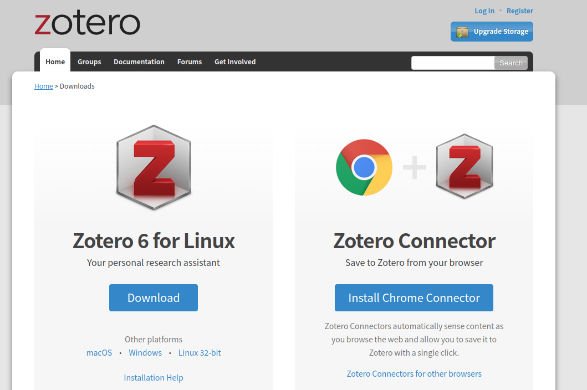
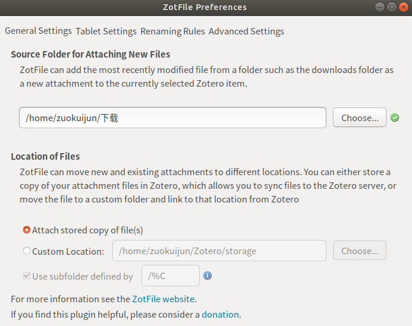

# Zotero + 坚果云 实现文献管理

# Zotero + 坚果云实现科研 文献管理

1、Zotero是开源的文献管理软件，目前版本6已经支持直接查看PDF与做笔记注释等功能，可以在官网免费下载与使用：https://www.zotero.org/download/ 。另外，IOS版本已经上线，苹果用户可以直接在 App Store 中下载使用。

进入下载页面后，会自动识别操作系统，直接点击下载按钮就可以下载安装。如果下默认的操作系统不是自己想要的，也可以点击下面的链接进行切换。

    

2、个人认为Zotero比较优秀的一个功能是支持文件上云以及多设备之间的文件同步，丰富的插件以及简单的界面也使得 Zotero在文献管理中使用比较友好。下面介绍如何利用Zotero+坚果云实现科研文献的上云以及多设备之间的同步。

3、主要参考[坚果云使用 Zotero 配置过程详解](https://help.jianguoyun.com/?p=4190)。

* 这里需要说明一点，教程中提到的[Zotfile](./zotero_xpi)可以在这里获取，不需要再次下载。点击工具》插件 》从文件导入，重启Zotero插件即安装完成。

* 其次，为了实现多设备文件的同步， 教程中可以说的不是很清楚，这里再次备注一下。

  在Zotero账号已经登录以及坚果云已经注册且Zotfile已经安装的情况下，选择工具》ZotFile Preferences 。第一个文件路径需要选择浏览器下载文件时，文件的存放路径。Windows系统以及MAC系统上的设置是类似的。同样需要登录Zotero账号以及设置文件的同步方式。这里的文件路径也是系统在文件下载时文件默认的存放路径。设置好之后文件就会自动同步每个设置之间的更改，关于坚果云更加详细的说明可以参考官网的说明文档进行学习。

* 安装翻译插件https://github.com/windingwind/zotero-pdf-translate#readme实现文档的自动翻译

  

      
  

  

